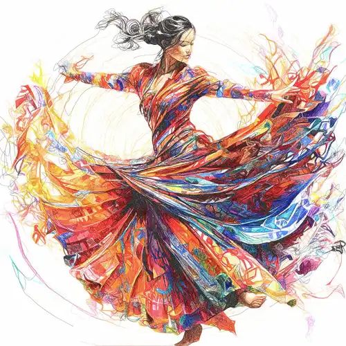
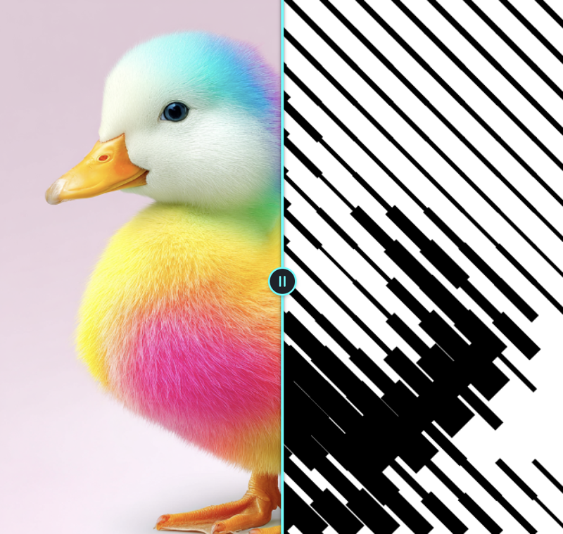
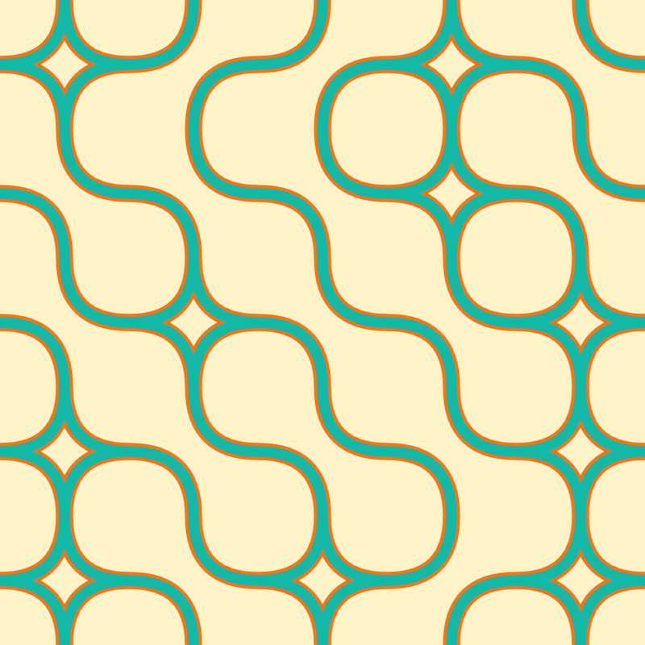
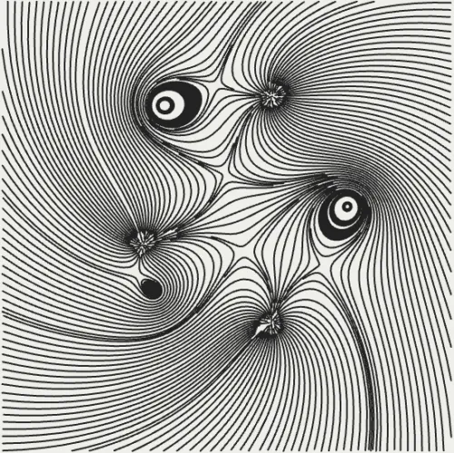
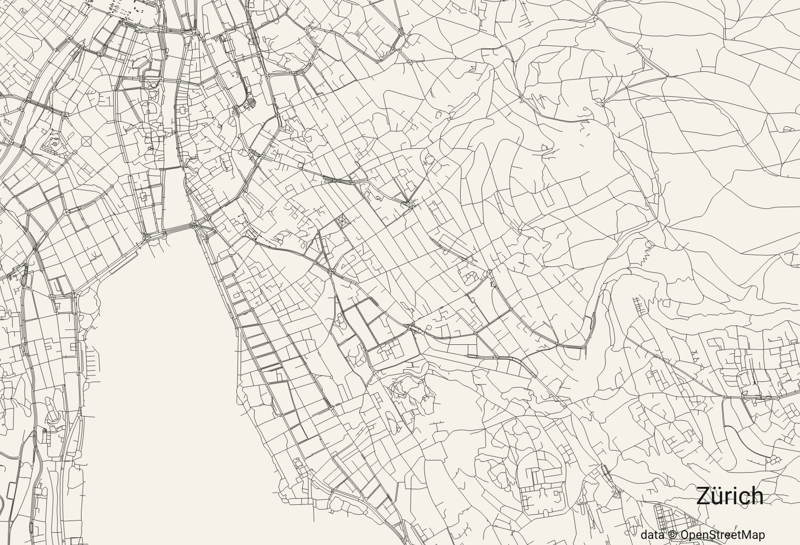
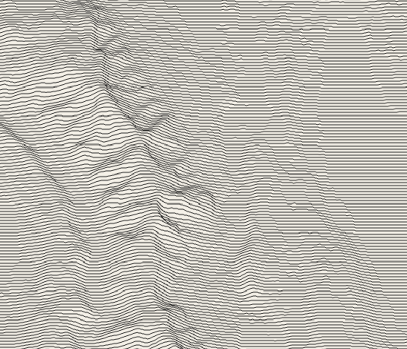

```
██████╗ ██╗      ██████╗ ████████╗████████╗███████╗██████╗   ██████████████▓▒░
██╔══██╗██║     ██╔═══██╗╚══██╔══╝╚══██╔══╝██╔════╝██╔══██╗  ███████████▓▒░
██████╔╝██║     ██║   ██║   ██║      ██║   █████╗  ██████╔╝  ████████▓▒░
██╔═══╝ ██║     ██║   ██║   ██║      ██║   ██╔══╝  ██╔══██╗  █████▓▒░
██║     ███████╗╚██████╔╝   ██║      ██║   ███████╗██║  ██║  ██▓▒░
╚═╝     ╚══════╝ ╚═════╝    ╚═╝      ╚═╝   ╚══════╝╚═╝  ╚═╝

  ╞════ a short list of plotter resources ════╡
```

# Plotter links

Software, code, machines and people for drawing with a pen plotter or a laser.
Kept short on purpose: every entry here is something I would open again.

## Start here

If you have never plotted anything, the shortest path runs through three of the
links below. Draw the artwork in [p5.js](https://p5js.org) and export it with
[p5.js-svg](https://github.com/zenozeng/p5.js-svg). Run the file through
[vpype](https://github.com/abey79/vpype) once, which sorts the paths, drops the
duplicates and scales the drawing to your paper. Then send it to the machine
with [saxi](https://github.com/alexrudd2/saxi) if you own an AxiDraw, or with
[juicy-gcode](https://github.com/domoszlai/juicy-gcode) and a GRBL sender if you
built your own. Everything else on this page is a detour worth taking later.

## Software and tools

### Preparing the file

- [vpype](https://github.com/abey79/vpype) — CLI pipeline that cleans, sorts, scales and merges SVG before it goes to the machine
- [vsketch](https://github.com/abey79/vsketch) — sketching framework on top of vpype, live reload and parameter sliders
- [Inkscape](https://inkscape.org) — the editor most plotter extensions plug into
- [contour-drawing](https://github.com/TLausZ/contour-drawing) — my own tool, turns a photo into contour lines and writes plotter ready SVG, forked from [krummrey](https://github.com/krummrey/contour-drawing)<br>
- [DrawingBotV3](https://drawingbotv3.com/) — turns photos into line drawings with dozens of pen and hatching styles, my favourite of the paid tools. Its author teaches it on [YouTube](https://www.youtube.com/@drawingbotv3): start with the [beginner series](https://www.youtube.com/playlist?list=PLDPNDW2dqMA0sAHhvuDRd27tcy28PWU8Z), then the [feature spotlights](https://www.youtube.com/playlist?list=PLDPNDW2dqMA2AiuVd0tzcL3Fd5FdHKqNj)<br>
- [svgsort](https://github.com/inconvergent/svgsort) — reorders paths to cut down pen travel
- [juicy-gcode](https://github.com/domoszlai/juicy-gcode) — SVG to G-code with proper curve fitting, for GRBL machines
- [GTracker](https://www.gcode.pro/) — browser based G-code generator for images and vectors, no install
- [Boxy SVG](https://boxy-svg.com/) — lightweight SVG editor in the browser, quick fixes without opening Inkscape
- [Graphite](https://graphite.rs/) — open source vector editor with a procedural node graph, still alpha but runs in the browser
- [p5-single-line-font-resources](https://github.com/golanlevin/p5-single-line-font-resources) — Golan Levin's archive of single line fonts with p5.js code to render them, the way to put text on a plot

### Image to plotter art

- [Vertigo](https://muffinman.io/vertigo/) — browser tool that turns an image into halftone dots, lines or waves and exports SVG
- [Plotterfun color](https://grbl-plotter.de/plotterfun-color/) — browser tool that turns an image into spirals, squiggles or hatching, this fork splits colours into separate layers for multi pen plots
- [PINTR](https://javier.xyz/pintr) — free browser tool that draws a photo as one continuous scribbled line, exports SVG
- [Tissage Studio](https://tissagestudio.etienne.design/) — turns an image into diagonal line bands of varying weight, browser based with a sample gallery<br>
- [PixelMe](https://pixel-me.tokyo/) — free tool that reduces a photo to pixel art, a coarse grid to plot as filled or hatched cells
- [AI Draw](https://ai-draw.tokyo/en/) — online photo to contour line art, downloads SVG
- [RapidResizer](https://online.rapidresizer.com/tracer.php) — free online tracer and [stencil maker](https://online.rapidresizer.com/photograph-to-pattern.php), no login, good enough for quick outlines
- [LuBan](https://www.luban3d.com/) — paid software that slices 3D models into layered cut files and turns photos into line and halftone art, not the free Snapmaker Luban

### Drivers and firmware

- [saxi](https://github.com/alexrudd2/saxi) — fast AxiDraw driver with a browser UI, plans motion better than the stock software; this fork is the one still being maintained
- [AxiDraw CLI and Python API](https://axidraw.com/doc/cli_api/) — the official way to drive an AxiDraw from a script
- [Klipper](https://github.com/Klipper3d/klipper) — firmware that moves the kinematics onto a host computer, worth it for a large or fast self built machine
- [MeerK40t](https://github.com/tatarize/meerk40t) — open source control for K40 and other diode lasers
- [LightBurn](https://lightburnsoftware.com) — the paid standard for laser cutting and engraving, worth it if you burn often
- [LaserGRBL](https://lasergrbl.com) — free GRBL sender for Windows, good starting point before buying LightBurn
- [GRBL-Plotter](https://github.com/svenhb/GRBL-Plotter) — Windows sender for GRBL machines that imports SVG, DXF and HPGL directly and handles pen changes
- [Inkcut](https://www.codelv.com/projects/inkcut/) — open source Inkscape extension that drives vinyl cutters and HPGL plotters directly
- [iDraw_GH](https://github.com/DalessandroJ/iDraw_GH) — Grasshopper component that streams G-code from Rhino straight to an iDraw or any GRBL plotter

## Generative art and code

- [p5.js](https://p5js.org) — easiest path from an idea to an SVG you can plot
- [p5.js-svg](https://github.com/zenozeng/p5.js-svg) — SVG renderer for p5.js, saves the sketch as paths instead of pixels
- [Processing](https://processing.org) — the Java original, still the best for heavy sketches
- [Paper.js](https://paperjs.org) — vector library with boolean operations, useful for hidden line removal
- [Turtletoy](https://turtletoy.net) — turtle graphics in the browser, every sketch exports plotter ready SVG
- [Krbn](https://github.com/vpalos/Krbn) — renders 3D scenes as pencil strokes, hidden lines and hatching solved analytically<br>
- [ln](https://github.com/fogleman/ln) — 3D scene renderer that outputs line art instead of pixels
- [plotter.vision](https://plotter.vision/) — STL to SVG in the browser with hidden line removal, wireframes that look right on paper
- [generative-noodles](https://github.com/cadin/generative-noodles) — Processing sketch that grows tangled noodle shapes and saves them as plotter ready SVG<br>
- [fishdraw](https://github.com/LingDong-/fishdraw) and [shan-shui-inf](https://github.com/LingDong-/shan-shui-inf) — Lingdong Huang's procedurally generated fish and endless Chinese landscape scrolls, both export SVG
- [Truchet Mosaic Generator](https://swazara.github.io/truchet-web-generator/) — Truchet tiles in the browser with swappable tile sets, exports SVG<br>
- [Book of Shapes](https://www.bookofshapes.com/) — Nikolaj Sokolowski's collection of minimal generative patterns, each one tweakable in the browser and exported as SVG<br>
- [Atypography](https://www.atypography.com/) — browser tool that bends type into generative line patterns, exports SVG, see the [manual](https://www.atypography.com/manual)
- [Constraint Systems](https://constraint.systems/) — Grant Custer's experimental browser tools for drawing and text, several export SVG
- [Generative Artistry](https://www.generativeartistry.com) — tutorials that rebuild classic plotter works step by step
- [Sighack](https://sighack.com) — Manohar Vanga on fills, hatching and space filling curves, with code
- [Inconvergent](https://inconvergent.net/generative/) — Anders Hoff's writings on the algorithms behind his plots
- [The Coding Train](https://thecodingtrain.com) — video course for everything from noise fields to L-systems

### Maps

- [city-roads](https://anvaka.github.io/city-roads/) — draws every road of a city from OpenStreetMap and exports SVG, [source](https://github.com/anvaka/city-roads)<br>
- [Peak map](https://anvaka.github.io/peak-map/) — ridgeline drawing of the elevation of any region, exports SVG<br>
- [QGIS](https://qgis.org/) — open source GIS, the heavy tool for contour lines and coastlines from real data, exports SVG
- [Boundless Maps](https://boundlessmaps.com/) — paid vector maps of cities and regions, delivered as SVG ready to plot

## Machines and materials

### Ready made

- [AxiDraw](https://axidraw.com) — the reference pen plotter, holds almost any pen
- [NextDraw](https://bantamtools.com/products/bantam-tools-nextdraw) — successor built by Bantam Tools, faster and quieter
- [UUNA TEK iDraw](https://www.uunatek.com) — the cheaper AxiDraw style machine, same working principle
- [Line-us](https://www.line-us.com) — small robot arm, cheap way to find out whether plotting is for you
- [Silhouette](https://www.silhouetteamerica.com) — cutting machines that take a pen holder, a common way in for people who already own one

### Open source and self built

- [BrachioGraph](https://www.brachiograph.art) — two servos and a clothes peg, the cheapest machine that draws
- [Makelangelo](https://github.com/MarginallyClever/Makelangelo) — wall hanging polargraph, software and firmware are open, kits are sold by [Marginally Clever](https://www.marginallyclever.com)
- [Polargraph](https://github.com/euphy/polargraph) — long running hanging plotter project, firmware plus the controller software
- [EggBot](https://github.com/evil-mad/EggBot) — for drawing on eggs, bulbs and other spherical objects
- [OpenBuilds ACRO](https://openbuilds.com/builds/openbuilds-acro-system.5416/) — extrusion gantry sold as a kit, the usual base for a large self built plotter
- [AxiDraw sources](https://github.com/evil-mad/axidraw) — the control software of a commercial machine, published openly and useful to read

### Pens, paper and reference

- [AxiDraw wiki](https://wiki.evilmadscientist.com/AxiDraw) — manuals, pen holder mods, troubleshooting
- [Evil Mad Scientist pen shop](https://shop.evilmadscientist.com/productsmenu/968) — pens tested to work in a plotter
- [HP Computer Museum](https://www.hpmuseum.net) — documentation for vintage HP pen plotters still in use

## Community and inspiration

- [awesome-plotters](https://github.com/beardicus/awesome-plotters) — the big list, go there when this one is too short
- [DrawingBots](https://drawingbots.net) — hub with software comparisons and an active Discord, see the [tools page](https://drawingbots.com/knowledge/tools/) and the [algorithms overview](https://drawingbots.com/algorithms/)
- [r/PlotterArt](https://www.reddit.com/r/PlotterArt/) — daily plots, and a [wiki](https://www.reddit.com/r/PlotterArt/wiki/index) with pen and paper recommendations
- [r/plotters](https://www.reddit.com/r/plotters/) — the hardware side, repairs and vintage machines
- [r/proceduralgeneration](https://www.reddit.com/r/proceduralgeneration/) — algorithms first, plenty of it ends up on paper
- [Generative Hut](https://www.generativehut.com) — interviews and tutorials from plotter artists
- [Genuary](https://genuary.art) — one generative prompt a day every January
- [Tyler Hobbs](https://www.tylerxhobbs.com/words) — essays on generative work, start with [flow fields](https://tylerxhobbs.com/essays/2020/flow-fields)
- [Amy Goodchild](https://www.amygoodchild.com/blog) — clear write-ups of her own plotter projects
- [Painting With Plotters](https://www.eyesofpanda.com/project/painting_with_plotters/) — Licia He on plotting with brushes and watercolour instead of pens, including the rig for dipping and rinsing
- [Mario De Meyer on Scenery](https://scenery.io/@mariodemeyer/) — parametric plotter sketches you can tweak in the browser and export as SVG
- [PlotterFiles](https://plotterfiles.com/artwork) — free SVG files made for plotters, handy for testing a new machine or pen
- [#plottertwitter](https://www.instagram.com/explore/tags/plottertwitter/) — the tag survived the move off Twitter

## Contributing

Open an issue or a pull request. One line per link, say what it is good for.

## License

[CC0](LICENSE). Do whatever you want with this list.
