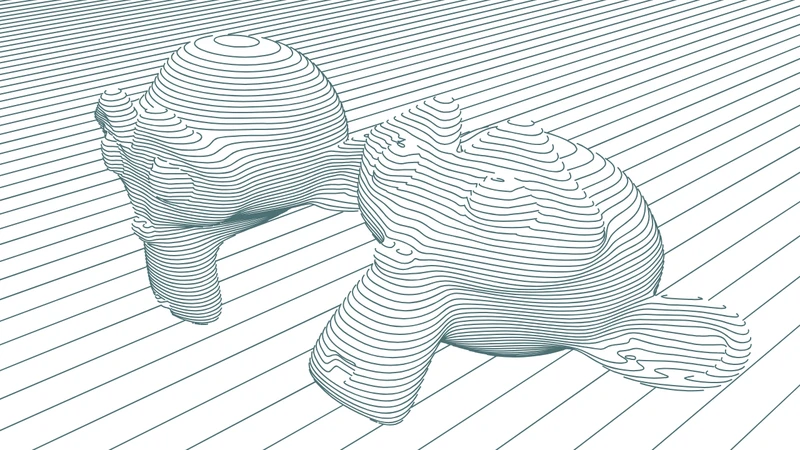
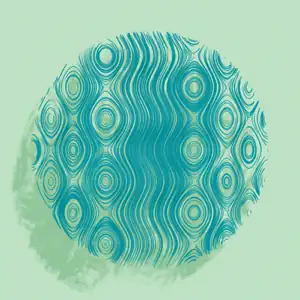
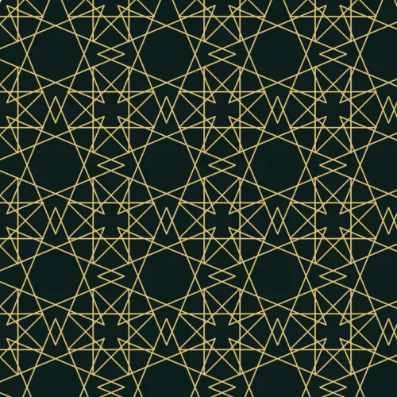

```
██████╗ ██╗      ██████╗ ████████╗████████╗███████╗██████╗   ██████████████▓▒░
██╔══██╗██║     ██╔═══██╗╚══██╔══╝╚══██╔══╝██╔════╝██╔══██╗  ███████████▓▒░
██████╔╝██║     ██║   ██║   ██║      ██║   █████╗  ██████╔╝  ████████▓▒░
██╔═══╝ ██║     ██║   ██║   ██║      ██║   ██╔══╝  ██╔══██╗  █████▓▒░
██║     ███████╗╚██████╔╝   ██║      ██║   ███████╗██║  ██║  ██▓▒░
╚═╝     ╚══════╝ ╚═════╝    ╚═╝      ╚═╝   ╚══════╝╚═╝  ╚═╝

  ╞════ a short list of plotter resources ════╡
```

# Plotter links

Software, code, machines and people for drawing with a pen plotter or a laser.
Kept short on purpose: every entry here is something I would open again.

## Start here

If you have never plotted anything, the shortest path runs through three of the
links below. Draw the artwork in [p5.js](https://p5js.org) and export it with
[p5.js-svg](https://github.com/zenozeng/p5.js-svg). Run the file through
[vpype](https://github.com/abey79/vpype) once, which sorts the paths, drops the
duplicates and scales the drawing to your paper. Then send it to the machine
with [saxi](https://github.com/alexrudd2/saxi) if you own an AxiDraw, or with
[juicy-gcode](https://github.com/domoszlai/juicy-gcode) and a GRBL sender if you
built your own. Everything else on this page is a detour worth taking later.

## Software and tools

### Preparing the file

<table>
<tr><td><a href="https://github.com/abey79/vpype">vpype</a> — CLI pipeline that cleans, sorts, scales and merges SVG before it goes to the machine</td><td width="400"></td></tr>
<tr><td><a href="https://github.com/abey79/vsketch">vsketch</a> — sketching framework on top of vpype, live reload and parameter sliders</td><td width="400"></td></tr>
<tr><td><a href="https://inkscape.org">Inkscape</a> — the editor most plotter extensions plug into</td><td width="400"></td></tr>
<tr><td><a href="https://github.com/TLausZ/contour-drawing">contour-drawing</a> — my own tool, turns a photo into contour lines and writes plotter ready SVG, forked from <a href="https://github.com/krummrey/contour-drawing">krummrey</a></td><td width="400"></td></tr>
<tr><td><a href="https://drawingbotv3.com/">DrawingBotV3</a> — turns photos into line drawings with dozens of pen and hatching styles, my favourite of the paid tools. Its author teaches it on <a href="https://www.youtube.com/@drawingbotv3">YouTube</a>: start with the <a href="https://www.youtube.com/playlist?list=PLDPNDW2dqMA0sAHhvuDRd27tcy28PWU8Z">beginner series</a>, then the <a href="https://www.youtube.com/playlist?list=PLDPNDW2dqMA2AiuVd0tzcL3Fd5FdHKqNj">feature spotlights</a></td><td width="400"></td></tr>
<tr><td><a href="https://github.com/inconvergent/svgsort">svgsort</a> — reorders paths to cut down pen travel</td><td width="400"></td></tr>
<tr><td><a href="https://github.com/domoszlai/juicy-gcode">juicy-gcode</a> — SVG to G-code with proper curve fitting, for GRBL machines</td><td width="400"></td></tr>
<tr><td><a href="https://www.gcode.pro/">GTracker</a> — browser based G-code generator for images and vectors, no install</td><td width="400"></td></tr>
<tr><td><a href="https://boxy-svg.com/">Boxy SVG</a> — lightweight SVG editor in the browser, quick fixes without opening Inkscape</td><td width="400"></td></tr>
<tr><td><a href="https://graphite.rs/">Graphite</a> — open source vector editor with a procedural node graph, still alpha but runs in the browser</td><td width="400"></td></tr>
<tr><td><a href="https://github.com/golanlevin/p5-single-line-font-resources">p5-single-line-font-resources</a> — Golan Levin's archive of single line fonts with p5.js code to render them, the way to put text on a plot</td><td width="400"></td></tr>
</table>

### Image to plotter art

<table>
<tr><td><a href="https://muffinman.io/vertigo/">Vertigo</a> — browser tool that turns an image into halftone dots, lines or waves and exports SVG</td><td width="400"></td></tr>
<tr><td><a href="https://grbl-plotter.de/plotterfun-color/">Plotterfun color</a> — browser tool that turns an image into spirals, squiggles or hatching, this fork splits colours into separate layers for multi pen plots</td><td width="400"></td></tr>
<tr><td><a href="https://javier.xyz/pintr">PINTR</a> — free browser tool that draws a photo as one continuous scribbled line, exports SVG</td><td width="400"></td></tr>
<tr><td><a href="https://tissagestudio.etienne.design/">Tissage Studio</a> — turns an image into diagonal line bands of varying weight, browser based with a sample gallery</td><td width="400"></td></tr>
<tr><td><a href="https://pixel-me.tokyo/">PixelMe</a> — free tool that reduces a photo to pixel art, a coarse grid to plot as filled or hatched cells</td><td width="400"></td></tr>
<tr><td><a href="https://ai-draw.tokyo/en/">AI Draw</a> — online photo to contour line art, downloads SVG</td><td width="400"></td></tr>
<tr><td><a href="https://online.rapidresizer.com/tracer.php">RapidResizer</a> — free online tracer and <a href="https://online.rapidresizer.com/photograph-to-pattern.php">stencil maker</a>, no login, good enough for quick outlines</td><td width="400"></td></tr>
<tr><td><a href="https://github.com/shunyagatha/Vecline">Vecline</a> — open source raster to SVG tracer with centerline mode, bit-exact on flat artwork and measured against potrace and vtracer, also writes DXF and G-code, runs in the browser at <a href="https://vecline.xyz">vecline.xyz</a></td><td width="400"></td></tr>
<tr><td><a href="https://www.luban3d.com/">LuBan</a> — paid software that slices 3D models into layered cut files and turns photos into line and halftone art, not the free Snapmaker Luban</td><td width="400"></td></tr>
</table>

### Drivers and firmware

<table>
<tr><td><a href="https://github.com/alexrudd2/saxi">saxi</a> — fast AxiDraw driver with a browser UI, plans motion better than the stock software; this fork is the one still being maintained</td><td width="400"></td></tr>
<tr><td><a href="https://axidraw.com/doc/cli_api/">AxiDraw CLI and Python API</a> — the official way to drive an AxiDraw from a script</td><td width="400"></td></tr>
<tr><td><a href="https://github.com/Klipper3d/klipper">Klipper</a> — firmware that moves the kinematics onto a host computer, worth it for a large or fast self built machine</td><td width="400"></td></tr>
<tr><td><a href="https://github.com/tatarize/meerk40t">MeerK40t</a> — open source control for K40 and other diode lasers</td><td width="400"></td></tr>
<tr><td><a href="https://lightburnsoftware.com">LightBurn</a> — the paid standard for laser cutting and engraving, worth it if you burn often</td><td width="400"></td></tr>
<tr><td><a href="https://lasergrbl.com">LaserGRBL</a> — free GRBL sender for Windows, good starting point before buying LightBurn</td><td width="400"></td></tr>
<tr><td><a href="https://github.com/svenhb/GRBL-Plotter">GRBL-Plotter</a> — Windows sender for GRBL machines that imports SVG, DXF and HPGL directly and handles pen changes</td><td width="400"></td></tr>
<tr><td><a href="https://www.codelv.com/projects/inkcut/">Inkcut</a> — open source Inkscape extension that drives vinyl cutters and HPGL plotters directly</td><td width="400"></td></tr>
<tr><td><a href="https://github.com/DalessandroJ/iDraw_GH">iDraw_GH</a> — Grasshopper component that streams G-code from Rhino straight to an iDraw or any GRBL plotter</td><td width="400"></td></tr>
</table>

## Generative art and code

<table>
<tr><td><a href="https://p5js.org">p5.js</a> — easiest path from an idea to an SVG you can plot</td><td width="400"></td></tr>
<tr><td><a href="https://github.com/zenozeng/p5.js-svg">p5.js-svg</a> — SVG renderer for p5.js, saves the sketch as paths instead of pixels</td><td width="400"></td></tr>
<tr><td><a href="https://processing.org">Processing</a> — the Java original, still the best for heavy sketches</td><td width="400"></td></tr>
<tr><td><a href="https://paperjs.org">Paper.js</a> — vector library with boolean operations, useful for hidden line removal</td><td width="400"></td></tr>
<tr><td><a href="https://turtletoy.net">Turtletoy</a> — turtle graphics in the browser, every sketch exports plotter ready SVG</td><td width="400"></td></tr>
<tr><td><a href="https://github.com/vpalos/Krbn">Krbn</a> — renders 3D scenes as pencil strokes, hidden lines and hatching solved analytically</td><td width="400"></td></tr>
<tr><td><a href="https://github.com/fogleman/ln">ln</a> — 3D scene renderer that outputs line art instead of pixels</td><td width="400"></td></tr>
<tr><td><a href="https://plotter.vision/">plotter.vision</a> — STL to SVG in the browser with hidden line removal, wireframes that look right on paper</td><td width="400"></td></tr>
<tr><td><a href="https://docs.blender.org/manual/en/3.6/addons/render/render_freestyle_svg.html">Blender Freestyle SVG export</a> — the Freestyle SVG Exporter add-on writes Blender's non-photorealistic line rendering straight to SVG, contour lines and hidden line removal for any 3D scene, bundled with Blender up to 4.1</td><td width="400"></td></tr>
<tr><td><a href="https://msurguy.github.io/streamline-loops/?preset=Cosine%20Weave&tr=0.004&lw=0.004&lc=%2331d4e2&bg=%239effb6&cm=blender%20path&pj=orthographic&os=3&ls=30">Streamline Loops</a> — Maksim Surguy's browser tool that traces streamlines through formula-defined 3D vector fields and renders them as looping orbit animations, the flat meshline mode looks like a plot, exports MP4 or PNG frames but no SVG</td><td width="400"></td></tr>
<tr><td><a href="https://github.com/cadin/generative-noodles">generative-noodles</a> — Processing sketch that grows tangled noodle shapes and saves them as plotter ready SVG</td><td width="400"></td></tr>
<tr><td><a href="https://github.com/LingDong-/fishdraw">fishdraw</a> and <a href="https://github.com/LingDong-/shan-shui-inf">shan-shui-inf</a> — Lingdong Huang's procedurally generated fish and endless Chinese landscape scrolls, both export SVG</td><td width="400"></td></tr>
<tr><td><a href="https://swazara.github.io/truchet-web-generator/">Truchet Mosaic Generator</a> — Truchet tiles in the browser with swappable tile sets, exports SVG</td><td width="400"></td></tr>
<tr><td><a href="https://www.bookofshapes.com/">Book of Shapes</a> — Nikolaj Sokolowski's collection of minimal generative patterns, each one tweakable in the browser and exported as SVG</td><td width="400"></td></tr>
<tr><td><a href="https://geopatternlab.com/">GeoPatternLab</a> — over 50 browser tools for kaleidoscopes, mandalas, op art, tilings and Islamic geometry, the vector ones export SVG and every setting sits in the URL</td><td width="400"></td></tr>
<tr><td><a href="https://morphingtiling.wordpress.com/2010/12/24/hello-world/">Morphing Tilings</a> — free TrueType fonts where each uppercase letter is a Truchet or morphing tile, type a block of text and convert the outlines to paths</td><td width="400"></td></tr>
<tr><td><a href="https://www.atypography.com/">Atypography</a> — browser tool that bends type into generative line patterns, exports SVG, see the <a href="https://www.atypography.com/manual">manual</a></td><td width="400"></td></tr>
<tr><td><a href="https://constraint.systems/">Constraint Systems</a> — Grant Custer's experimental browser tools for drawing and text, several export SVG</td><td width="400"></td></tr>
<tr><td><a href="https://www.generativeartistry.com">Generative Artistry</a> — tutorials that rebuild classic plotter works step by step</td><td width="400"></td></tr>
<tr><td><a href="https://observablehq.com/@mbostock">Mike Bostock on Observable</a> — the D3 author's notebooks, hundreds of live examples for Voronoi, contours, hexbins and force layouts, all runnable in the browser</td><td width="400"></td></tr>
<tr><td><a href="https://sighack.com">Sighack</a> — Manohar Vanga on fills, hatching and space filling curves, with code</td><td width="400"></td></tr>
<tr><td><a href="https://inconvergent.net/generative/">Inconvergent</a> — Anders Hoff's writings on the algorithms behind his plots</td><td width="400"></td></tr>
<tr><td><a href="https://thecodingtrain.com">The Coding Train</a> — video course for everything from noise fields to L-systems</td><td width="400"></td></tr>
</table>

### Maps

<table>
<tr><td><a href="https://anvaka.github.io/city-roads/">city-roads</a> — draws every road of a city from OpenStreetMap and exports SVG, <a href="https://github.com/anvaka/city-roads">source</a></td><td width="400"></td></tr>
<tr><td><a href="https://anvaka.github.io/peak-map/">Peak map</a> — ridgeline drawing of the elevation of any region, exports SVG</td><td width="400"></td></tr>
<tr><td><a href="https://qgis.org/">QGIS</a> — open source GIS, the heavy tool for contour lines and coastlines from real data, exports SVG</td><td width="400"></td></tr>
<tr><td><a href="https://boundlessmaps.com/">Boundless Maps</a> — paid vector maps of cities and regions, delivered as SVG ready to plot</td><td width="400"></td></tr>
</table>

## Machines and materials

### Ready made

<table>
<tr><td><a href="https://axidraw.com">AxiDraw</a> — the reference pen plotter, holds almost any pen</td><td width="400"></td></tr>
<tr><td><a href="https://bantamtools.com/products/bantam-tools-nextdraw">NextDraw</a> — successor built by Bantam Tools, faster and quieter</td><td width="400"></td></tr>
<tr><td><a href="https://www.uunatek.com">UUNA TEK iDraw</a> — the cheaper AxiDraw style machine, same working principle</td><td width="400"></td></tr>
<tr><td><a href="https://www.line-us.com">Line-us</a> — small robot arm, cheap way to find out whether plotting is for you</td><td width="400"></td></tr>
<tr><td><a href="https://www.silhouetteamerica.com">Silhouette</a> — cutting machines that take a pen holder, a common way in for people who already own one</td><td width="400"></td></tr>
</table>

### Open source and self built

<table>
<tr><td><a href="https://www.brachiograph.art">BrachioGraph</a> — two servos and a clothes peg, the cheapest machine that draws</td><td width="400"></td></tr>
<tr><td><a href="https://github.com/MarginallyClever/Makelangelo">Makelangelo</a> — wall hanging polargraph, software and firmware are open, kits are sold by <a href="https://www.marginallyclever.com">Marginally Clever</a></td><td width="400"></td></tr>
<tr><td><a href="https://github.com/euphy/polargraph">Polargraph</a> — long running hanging plotter project, firmware plus the controller software</td><td width="400"></td></tr>
<tr><td><a href="https://github.com/evil-mad/EggBot">EggBot</a> — for drawing on eggs, bulbs and other spherical objects</td><td width="400"></td></tr>
<tr><td><a href="https://openbuilds.com/builds/openbuilds-acro-system.5416/">OpenBuilds ACRO</a> — extrusion gantry sold as a kit, the usual base for a large self built plotter</td><td width="400"></td></tr>
<tr><td><a href="https://github.com/evil-mad/axidraw">AxiDraw sources</a> — the control software of a commercial machine, published openly and useful to read</td><td width="400"></td></tr>
</table>

### Pens, paper and reference

<table>
<tr><td><a href="https://piterpasma.nl/articles/line-test">Line test</a> — Piter Pasma's SVG that fans lines apart from 0 to 5 mm, plot it once per pen and read off the real line width for your stroke-width settings</td><td width="400"></td></tr>
<tr><td><a href="https://laserpilot.github.io/Pen-Plotter-Calibration/">Pen Plotter Calibration</a> — browser tool that builds per pen test sheets for spacing, hatching and stippling, plus an analyzer that flags and nudges apart lines in your SVG that sit too close</td><td width="400"></td></tr>
<tr><td><a href="https://wiki.evilmadscientist.com/AxiDraw">AxiDraw wiki</a> — manuals, pen holder mods, troubleshooting</td><td width="400"></td></tr>
<tr><td><a href="https://shop.evilmadscientist.com/productsmenu/968">Evil Mad Scientist pen shop</a> — pens tested to work in a plotter</td><td width="400"></td></tr>
<tr><td><a href="https://www.hpmuseum.net">HP Computer Museum</a> — documentation for vintage HP pen plotters still in use</td><td width="400"></td></tr>
</table>

## Community and inspiration

<table>
<tr><td><a href="https://github.com/beardicus/awesome-plotters">awesome-plotters</a> — the big list, go there when this one is too short</td><td width="400"></td></tr>
<tr><td><a href="https://drawingbots.net">DrawingBots</a> — hub with software comparisons and an active Discord, see the <a href="https://drawingbots.com/knowledge/tools/">tools page</a> and the <a href="https://drawingbots.com/algorithms/">algorithms overview</a></td><td width="400"></td></tr>
<tr><td><a href="https://www.reddit.com/r/PlotterArt/">r/PlotterArt</a> — daily plots, and a <a href="https://www.reddit.com/r/PlotterArt/wiki/index">wiki</a> with pen and paper recommendations</td><td width="400"></td></tr>
<tr><td><a href="https://www.reddit.com/r/plotters/">r/plotters</a> — the hardware side, repairs and vintage machines</td><td width="400"></td></tr>
<tr><td><a href="https://www.reddit.com/r/proceduralgeneration/">r/proceduralgeneration</a> — algorithms first, plenty of it ends up on paper</td><td width="400"></td></tr>
<tr><td><a href="https://www.generativehut.com">Generative Hut</a> — interviews and tutorials from plotter artists</td><td width="400"></td></tr>
<tr><td><a href="https://genuary.art">Genuary</a> — one generative prompt a day every January</td><td width="400"></td></tr>
<tr><td><a href="https://www.tylerxhobbs.com/words">Tyler Hobbs</a> — essays on generative work, start with <a href="https://tylerxhobbs.com/essays/2020/flow-fields">flow fields</a></td><td width="400"></td></tr>
<tr><td><a href="https://www.amygoodchild.com/blog">Amy Goodchild</a> — clear write-ups of her own plotter projects</td><td width="400"></td></tr>
<tr><td><a href="https://www.eyesofpanda.com/project/painting_with_plotters/">Painting With Plotters</a> — Licia He on plotting with brushes and watercolour instead of pens, including the rig for dipping and rinsing</td><td width="400"></td></tr>
<tr><td><a href="https://scenery.io/">Scenery</a> — community site for Cavalry, the motion design app whose procedural scenes export as SVG, hundreds of downloadable scene files to pick apart</td><td width="400"></td></tr>
<tr><td><a href="https://scenery.io/@mariodemeyer/">Mario De Meyer on Scenery</a> — parametric plotter sketches you can tweak in the browser and export as SVG</td><td width="400"></td></tr>
<tr><td><a href="https://plotterfiles.com/artwork">PlotterFiles</a> — free SVG files made for plotters, handy for testing a new machine or pen</td><td width="400"></td></tr>
<tr><td><a href="https://www.instagram.com/explore/tags/plottertwitter/">#plottertwitter</a> — the tag survived the move off Twitter</td><td width="400"></td></tr>
</table>

## Contributing

Open an issue or a pull request. One line per link, say what it is good for.

## License

[CC0](LICENSE). Do whatever you want with this list.
